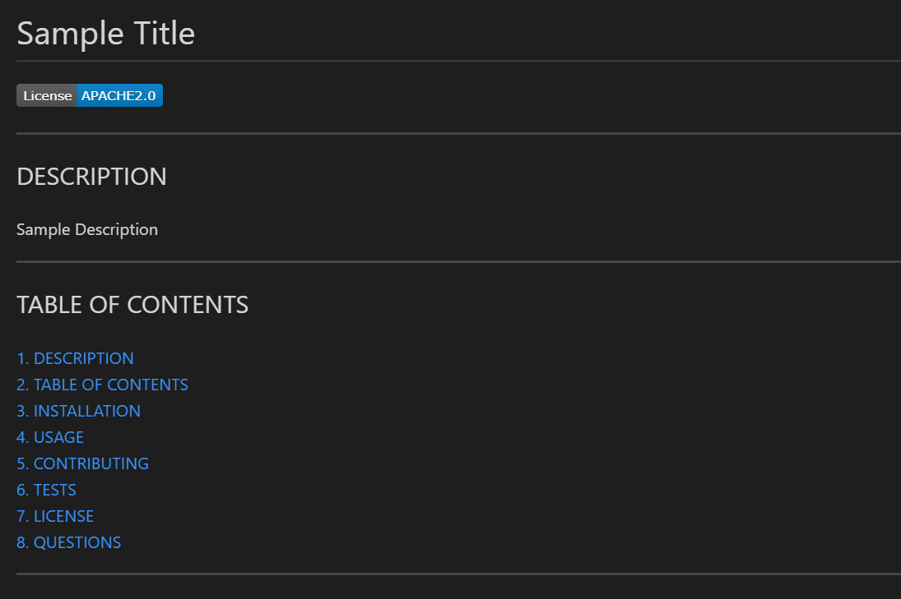

# README Generator

## DESCRIPTION
An application that allows the user to generate a professional README file from the command.

---

## TABLE OF CONTENTS
[1. DESCRIPTION](#DESCRIPTION)  
[2. TABLE OF CONTENTS](#TABLE-OF-CONTENTS)  
[3. INSTALLATION](#INSTALLATION)  
[4. USAGE](#USAGE)  
[5. CONTRIBUTING](#CONTRIBUTING)  
[6. TESTS](#TESTS)  
[7. LICENSE](#LICENSE)  
[8. QUESTIONS](#QUESTIONS)  
[9. DEMO VIDEO](#VIDEO-DEMO)

---

## INSTALLATION
Download or clone the repo from GitHub at <https://github.com/brandonljackson23/readme-generator>. Then, install Node.js at <https://nodejs.org/en/> and the Inquirer package at <https://www.npmjs.com/package/inquirer>.

---

## USAGE
Once you have the repo downloaded on your local machine, open terminal and navigate to the location where you installed the repo.  Once you find the repo files, navigate to the 'Develop' directory inside terminal.  Once you have located the Develop directory, type the following on the command line:

node index.js

This will initiate the prompts.  Answer each of the questions.  Once you are done answering all the questions, your new README file will be created and stored in the 'dist' directory inside the 'Develop' directory.

---

## CONTRIBUTING
Currently, Brandon Jackson is the sole contributor to this application and he is not accepting additional contributors.

---

## TESTS
No tests have been written for this application.

---

## LICENSE
This application is covered under the following license(s): None

---

## QUESTIONS
If you have any questions please contact:  
|  Brandon Jackson  |  brandonljackson23@gmail.com  |  <https://github.com/brandonljackson23>  |

---

## VIDEO DEMO
To see a recorded demo of how the application works click on the image below:

